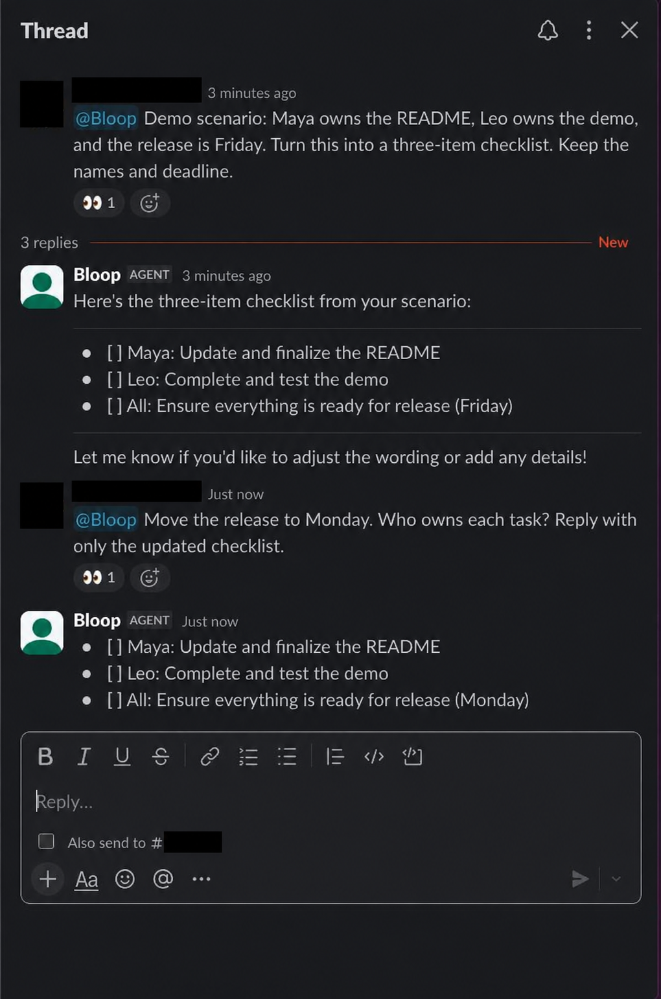
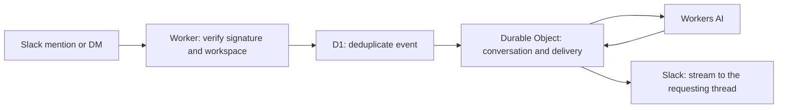

# Agentic Slack

Agentic Slack is a self-hosted agent runtime for Slack on Cloudflare Workers.

Mention the agent in a channel or send it a direct message to receive a streamed reply in Slack.
Channel threads have separate durable conversations; messages in the same DM channel share one conversation, including messages in different DM threads.
Replies always go to the requesting thread.

The agent has no built-in business integrations or external tools.
It receives admitted mentions and DMs, not the complete history of a Slack channel.
Configure its name, instructions, suggested prompts, retention, and model in `apps/slack-agent/agent.config.ts`.

This Bun monorepo separates reusable Slack admission and delivery code from the deployed application.
The current runtime uses Flue, Cloudflare Workers, Durable Objects, D1, and Workers AI.
It is self-hosted in your Cloudflare account; it is not a cloud-independent runtime or a locally hosted model.



Live conversation with the deployed agent, using a fictional release plan.
Personal identity and channel details have been redacted from the screenshot.
The follow-up changes the deadline without repeating the task owners, demonstrating context retained within the thread.



## Architecture

The core owns Slack admission and delivery, deduplication, retention helpers, and instruction composition.
The application selects Workers AI and connects the Flue agent lifecycle to durable delivery and retention.

The operator surface is `apps/slack-agent/agent.config.ts`: name, description, owner instructions, suggested prompts, retention, and model.

The Worker acknowledges an accepted event and hands the turn to `executionCtx.waitUntil`, so the response never waits for the deferred work that `waitUntil` keeps alive.
The deferred work refreshes retention, fires a best-effort `:eyes:` reaction on channel mentions, and dispatches the turn to the Durable Object.
The model turn and Slack delivery run later on the Durable Object from durable state, including on its alarm path when the live stream handle is gone.
The stream destination is passed as `initialData` that the model cannot influence.

## Delivery

The sanitizer withholds a bounded tail of `STREAM_TAIL_LENGTH` (512) characters before sending text to Slack.
It removes Slack broadcast syntax, escapes mention controls, redacts Slack token patterns, and redacts assignments whose names contain terms such as `TOKEN`, `SECRET`, `PASSWORD`, or `API_KEY`.
This is pattern-based output filtering, not a guarantee that arbitrary credentials or confidential content cannot appear in a reply.
Appends are coalesced at `COALESCE_CHARS` (1024) characters and on a `COALESCE_MS` (300) millisecond timer.
Retryable Slack failures use bounded backoff or `Retry-After`, capped at `MAX_RETRY_AFTER_MS` (2000) milliseconds per attempt and `MAX_RETRY_WAIT_MS` (4000) milliseconds across attempts.
A reply longer than `MAX_SLACK_MESSAGE_LENGTH` (3900) characters is truncated in place with a `(truncated)` notice instead of being split.
A turn that completes without text receives `SLACK_DELIVERY_FALLBACK`, and a turn that failed receives `SLACK_STREAM_FAILURE_NOTICE` instead.

## Retention

Retention is a sliding TTL refreshed on every turn: 7 days for DMs (`privateDays`) and 15 days for channels (`channelDays`).
Expiry is scheduled at that many days times 86400 seconds, then prior `expireConversation` schedules are cancelled.
When the latest expiry fires, the Durable Object is destroyed.
That destroy is the product's only conversation deletion mechanism.
An active conversation can therefore remain stored longer than 7 or 15 calendar days.
Delivery events and reply text are persisted before output sanitization; closing a delivery does not erase that record.
Expiry deletes the application's Durable Object state, not messages already sent to Slack or data subject to external service retention policies.

## Self-hosting

You need Git, Bun **1.3.14**, a Cloudflare account with Workers AI enabled, and permission to create and install a Slack app in your workspace.
Workers, Durable Objects, D1, and model inference use your Cloudflare account's quotas and billing.
One deployment serves one Slack app in one workspace.
Run the commands below from the repository root.

### 1. Install and verify

```sh
git clone https://github.com/cgaravitoq/agentic-slack.git
cd agentic-slack
bun install --frozen-lockfile
bun run verify
```

Verification builds a neutral Worker without deploying or requiring your Cloudflare credentials.

### 2. Configure your database

```sh
cp apps/slack-agent/wrangler.jsonc apps/slack-agent/wrangler.deploy.json
bunx wrangler login
bunx wrangler d1 create agentic-slack-staging --config apps/slack-agent/wrangler.deploy.json --env staging
```

Keep `wrangler.deploy.json` local: Git ignores it, along with `.env*` and `.dev.vars*` files except explicitly named examples.
In that file, set the `database_name` and `database_id` returned by Wrangler on `env.staging.d1_databases[0]`.
For an existing deployment, use its existing database rather than creating a replacement.
Keep the `flue-class-FlueSlackAgentAgent` SQLite migration: Flue injects the Durable Object binding at build time, but does not inject this migration.

```sh
bun run db:migrate:staging
```

This applies the checked-in deduplication schema to the database in your local deployment configuration.
`bun run db:migrate:local` only migrates the local development store.

### 3. Create the Slack app

At [Slack apps](https://api.slack.com/apps), create an app **From scratch** in your intended workspace.
Under **OAuth & Permissions**, add these bot token scopes and install the app to your workspace:

- `app_mentions:read`
- `assistant:write`
- `chat:write`
- `im:history`
- `reactions:write`

Copy the bot token from **OAuth & Permissions** and the signing secret and app ID from **Basic Information**.
Open Slack in a browser; the workspace ID is the `T...` segment in `https://app.slack.com/client/T.../C...`.
See [Slack's workspace ID guide](https://slack.com/help/articles/221769328-Locate-your-Slack-URL-or-ID) for details.
In `wrangler.deploy.json`, add `env.staging.vars` with `SLACK_TEAM_ID` and `SLACK_APP_ID` set to those IDs.
Only these two identifiers belong in `vars`; the bot token and signing secret are Worker secrets.

### 4. Deploy and connect Slack

```sh
bun run deploy:staging
bunx wrangler secret put SLACK_SIGNING_SECRET --config apps/slack-agent/wrangler.deploy.json --env staging
bunx wrangler secret put SLACK_BOT_TOKEN --config apps/slack-agent/wrangler.deploy.json --env staging
```

Enter each secret at Wrangler's prompt.
Do not put secret values in shell commands or configuration files.
The first deployment remains unready until all four Slack settings are present.
The deploy command preserves dashboard-managed variables with `--keep-vars`.

Use the HTTPS URL printed by deployment:

```sh
bun run manifest https://your-worker.example.com
curl --fail https://your-worker.example.com/health
```

Replace the example URL with your deployed Worker URL in both commands.
Paste the generated JSON into the existing Slack app's **App Manifest** and save it.
If Slack requests reinstallation or URL verification, complete it after the Worker secrets and IDs are configured.
The event endpoint is `/channels/slack/events`.
The manifest enables the Messages tab, agent messaging, mentions, DMs, and assistant thread events; interactivity, org deploy, socket mode, and token rotation remain disabled.
A ready health response is `{"status":"ready"}`; HTTP 503 lists missing binding names without revealing values.

### 5. Check the first conversation

Invite the app to a test channel, then send `@Slack Agent Reply with: hello`.
Confirm that it acknowledges the mention and streams its reply into that thread.
Send a follow-up mention in the same thread, then a DM to check both conversation surfaces.
A successful `/health` response checks configuration presence; it does not prove Slack delivery or model inference.

If nothing arrives, check the app's installation, channel membership, workspace/app IDs, and Event Subscriptions URL verification.
Use Cloudflare's Worker logs to inspect failed event handling.
Do not include message contents or credentials in public bug reports.

## Automated deployment

`.github/workflows/ci.yml` verifies pull requests against `staging` and `main`, including dependency advisories.
`.github/workflows/deploy.yml` verifies and deploys pushes to `staging`.
Before enabling deployments in your fork, configure its GitHub `staging` environment:

- Secrets: `CLOUDFLARE_API_TOKEN` and `CLOUDFLARE_ACCOUNT_ID`, scoped to your own account and required resources.
- Variable: `WRANGLER_CONFIG_JSON`, containing your complete local `wrangler.deploy.json` configuration, without Slack tokens or signing secrets.

The workflow writes that operator configuration to an ignored file only after verification, then migrates D1, deploys, and checks health.
It fails before migration when the configuration variable is missing.
Existing operators must preserve their current Worker name, D1 ID, and Durable Object migration when populating it.
The Slack secrets stay on the Worker and are provisioned separately.

Protect your integration branch with the `verify` status check and restrict the `staging` environment to deployments from `staging`.
This repository currently develops on `staging`; there is no tagged stable release yet.
Do not use `main` as a substitute for a tested release without comparing its revision.

## Security and support

Slack requests pass signature verification and must match the configured workspace and app before a turn is admitted.
Any eligible human in that workspace who can reach the installed app can interact with it; there is no per-user allowlist.
Delivery destinations come from trusted event data, not model output.
Instructions and output filtering reduce accidental disclosure but do not make untrusted prompts safe to receive credentials.
Conversation data is processed by Slack and Cloudflare, including Workers AI.
Tracing is enabled with model content capture disabled in the application configuration.

For a suspected vulnerability, use GitHub's **Report a vulnerability** option on the repository's Security tab when it is enabled.
If that option is unavailable, request a private contact channel from the maintainer without including vulnerability details.
Do not disclose credentials, exploit details, or private conversations in public issues.
For ordinary bugs, include your revision, Bun version, sanitized configuration, reproduction steps, and expected versus actual behavior.
Contributions should stay focused and pass `bun run verify`; external integrations and new agent behavior require an agreed scope.

Licensed under [Apache-2.0](LICENSE).

## Development

Install dependencies with Bun:

```sh
bun install --frozen-lockfile
```

Run the verification suite:

```sh
bun run verify
```

Generate a Slack manifest from the neutral agent configuration and a deployed Worker URL:

```sh
bun run manifest https://agent.example.com
```
